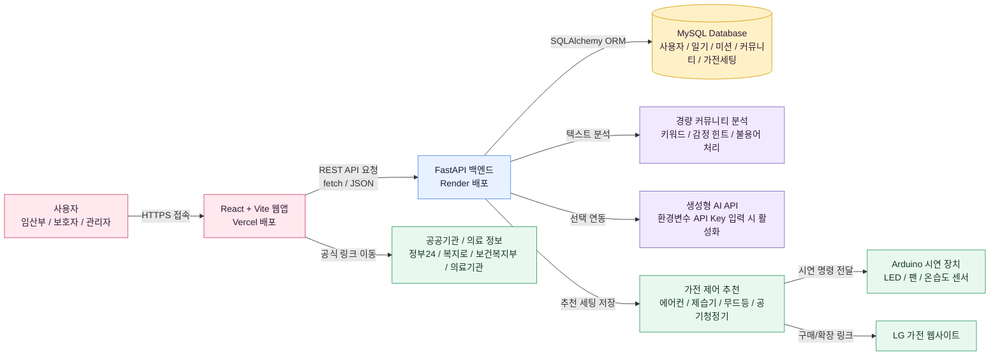
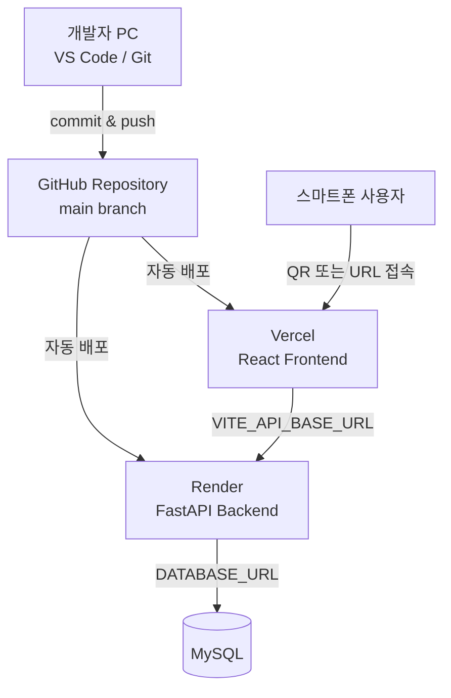
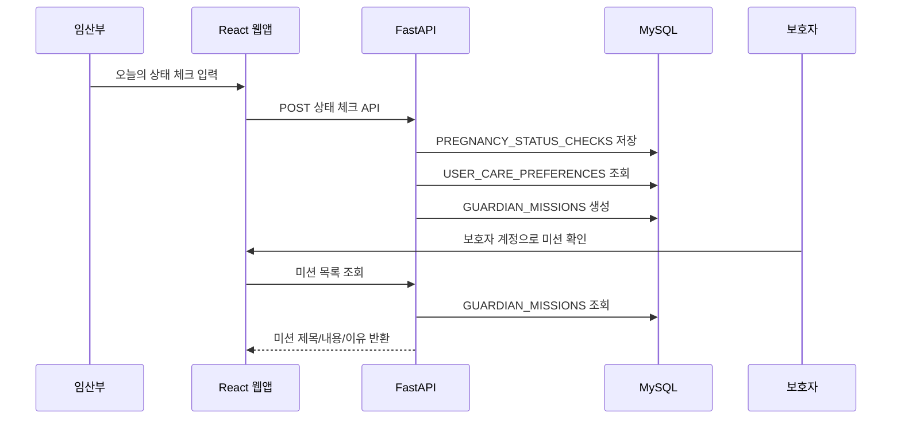
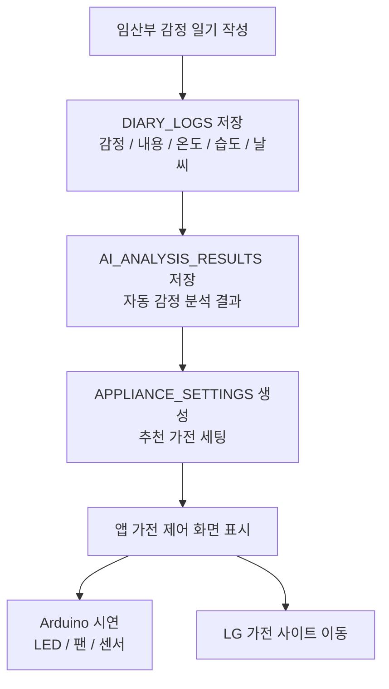
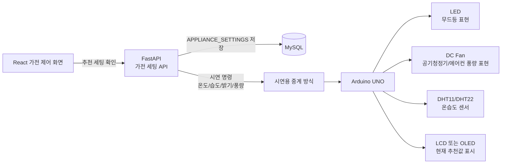
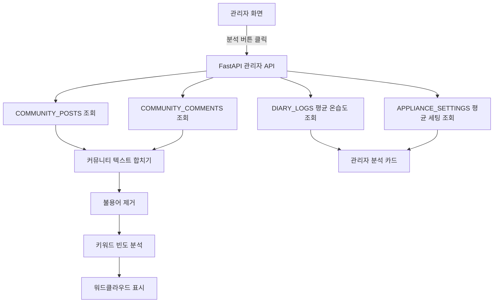

# MOMent(맘달) 시스템 아키텍처

## 1. 아키텍처 목적

MOMent는 임산부와 보호자가 사용하는 React 모바일 웹앱, FastAPI 백엔드, MySQL 데이터베이스, AI/텍스트 분석 기능, 공공기관 기반 정보 데이터, Arduino 기반 가전 제어 시연을 하나로 연결한 임신 케어 서비스다.

이 문서는 발표 자료와 Notion 정리용으로 작성한다. 아래 Mermaid 코드는 Notion, GitHub, Obsidian, Mermaid Live Editor 등에 붙여서 그림으로 변환할 수 있다.

## 2. 전체 시스템 구성도

## 3. 배포 구조

설명:

| 구성 | 역할 |
|---|---|
| GitHub | 소스 코드 저장소. main 브랜치 기준으로 배포한다. |
| Vercel | React/Vite 프론트엔드 배포. 사용자가 스마트폰으로 접속하는 주소를 제공한다. |
| Render | FastAPI 백엔드 배포. 로그인, 회원가입, 일기, 커뮤니티, 관리자 API를 제공한다. |
| MySQL | 서비스 데이터 저장. ERD에 정의된 테이블을 기반으로 한다. |
| QR 접속 | 발표/시연 시 Vercel URL을 QR로 만들어 앱처럼 접속한다. |

## 4. 사용자 기능 흐름

핵심 의도:

- 임산부의 상태 체크는 일기 저장이 아니다.
- 상태 체크는 보호자 미션 생성을 위한 입력이다.
- 보호자는 임산부의 민감한 감정 원문을 그대로 보는 것이 아니라 수행할 행동을 받는다.

## 5. 감정 일기와 가전 제어 흐름

예시:

| 감정/상황 | 추천 가전 제어 |
|---|---|
| 화남, 스트레스 높음 | 무드등 밝기 낮춤, 공기청정기 약풍, 실내 온도 안정화 |
| 피곤함, 습도 높음 | 제습기 목표 습도 52%, 에어컨 목표 온도 조정 |
| 불안함 | 무드등 따뜻한 색상, 공기청정기 저소음 모드 |

## 6. Arduino 시연 구조

시연 방식은 두 가지 중 하나로 선택할 수 있다.

| 방식 | 설명 | 난이도 |
|---|---|---|
| 단순 시연형 | 앱에서 추천 세팅을 보고 사람이 Arduino 버튼/시리얼 입력으로 같은 값을 실행한다. | 낮음 |
| 연동 시연형 | FastAPI 또는 로컬 중계 프로그램이 Arduino Serial로 명령을 보낸다. | 중간 |

발표용으로는 단순 시연형도 충분하다. 핵심은 “앱의 추천이 실제 가전 제어로 확장될 수 있다”는 흐름을 보여주는 것이다.

## 7. Arduino 시연 장치 구성 예시

| 앱의 가전 기능 | Arduino 부품 | 시연 표현 |
|---|---|---|
| 무드등 | RGB LED 또는 NeoPixel | 감정에 따라 색상 변경 |
| 에어컨 | DC Fan | 추천 풍량에 따라 팬 속도 변경 |
| 제습기 | LED + LCD | 목표 습도 표시, 제습 상태 LED ON |
| 공기청정기 | DC Fan + LED | 공기청정 세기 1~3단 표현 |
| 온습도 확인 | DHT11 또는 DHT22 | 현재 온도/습도 측정값 표시 |

## 8. 관리자 분석 아키텍처

분석 의도:

- 커뮤니티는 단순 게시판이 아니라 사용자의 고민 데이터다.
- 관리자 화면은 DX 프로젝트답게 텍스트 분석과 평균 환경 데이터를 보여준다.
- Kiwi 같은 무거운 형태소 분석기는 Render Free 512MB에서 메모리 문제가 생길 수 있으므로 기본은 경량 분석으로 둔다.

## 9. API 통신 구조

| 구분 | 요청 방향 | 설명 |
|---|---|---|
| 로그인 | React -> FastAPI | 이메일/비밀번호 인증 |
| 회원가입 | React -> FastAPI | 사용자 생성, 임신 시작일 검증 |
| 상태 체크 | React -> FastAPI | 상태 체크 저장, 보호자 미션 생성 |
| 감정 일기 | React -> FastAPI | 일기 저장, 감정 분석 결과 저장 |
| 커뮤니티 | React -> FastAPI | 게시글/댓글/좋아요 처리 |
| 관리자 | React -> FastAPI | 회원/커뮤니티/분석 데이터 조회 |
| 가전 제어 | React -> FastAPI -> Arduino 시연 | 추천 세팅 저장 후 시연 장치와 연결 |

## 10. 발표용 한 줄 설명

MOMent는 임산부가 입력한 상태, 감정, 주차, 커뮤니티 데이터를 FastAPI와 MySQL에 저장하고, 이를 바탕으로 보호자 미션, 주차별 추천, 커뮤니티 분석, 가전 제어 시연까지 연결하는 임신 케어 DX 서비스다.

## 11. Notion 사용 방법

1. 이 파일의 Mermaid 코드 블록을 복사한다.
2. Notion에 코드 블록을 만들고 언어를 Mermaid로 설정한다.
3. Notion에서 Mermaid 렌더링이 되지 않으면 [Mermaid Live Editor](https://mermaid.live/)에 붙여 이미지로 내보낸다.
4. 내보낸 PNG/SVG 이미지를 Notion에 삽입한다.
5. 발표 자료에는 “전체 시스템 구성도”, “Arduino 시연 구조”, “관리자 분석 아키텍처” 3개 그림을 사용하는 것이 가장 좋다.
