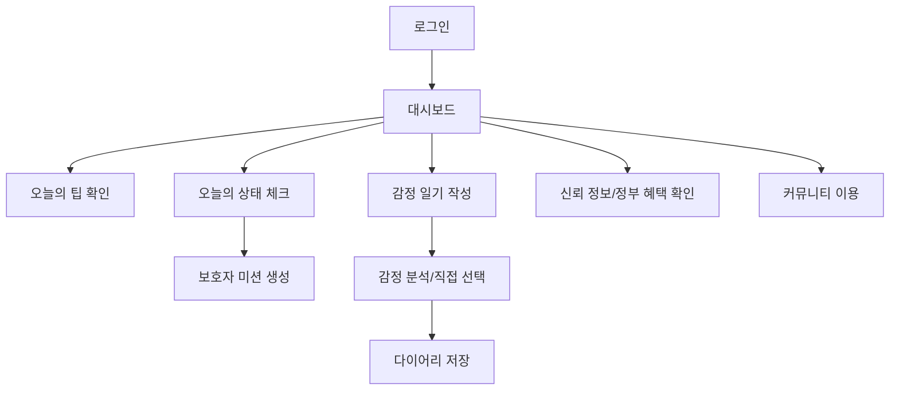
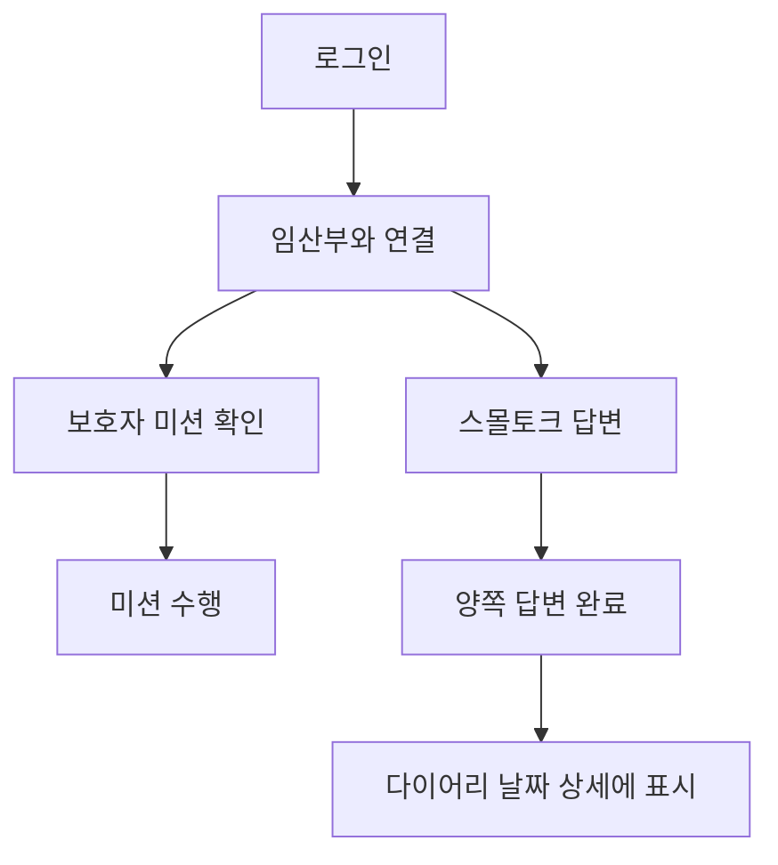
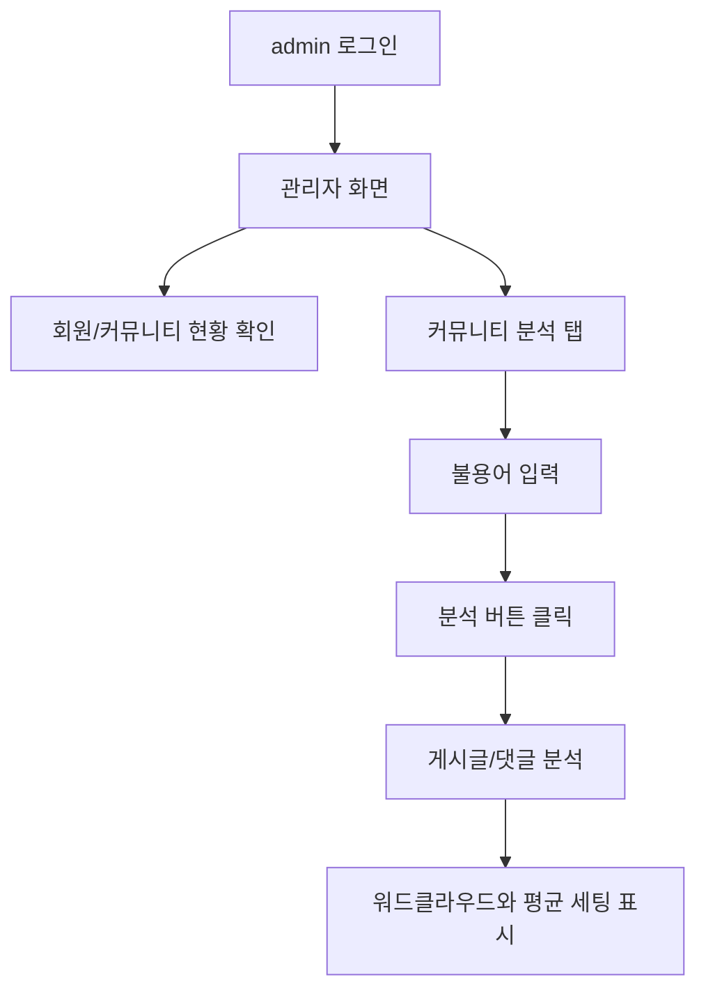

# MOMent(맘달) 화면설계서

## 1. 문서 목적

본 문서는 MOMent 프로젝트의 화면을 처음 보는 사람이 앱의 의도, 화면 구성, 데이터 흐름, 구현 대상을 이해할 수 있도록 정리한 화면설계서다. 단순히 화면 이름만 나열하지 않고, 각 화면에서 사용자가 무엇을 하고, 어떤 데이터가 저장되며, 어떤 다음 기능으로 이어지는지 설명한다.

## 2. 앱 전체 화면 의도

MOMent는 모바일 앱처럼 보이는 웹앱이다. 사용자는 대부분 스마트폰으로 접속한다고 가정하고, 화면 폭은 약 430px 기준으로 설계한다. 하단 탭을 통해 홈, 가전제어, 다이어리, 내 정보, 설정으로 이동하고, 홈 화면에서 상태 체크, 스몰토크, AI 추천, 신뢰 정보, 커뮤니티 등 주요 기능에 접근한다.

관리자 계정으로 로그인하면 일반 사용자 대시보드가 아니라 관리자 전용 화면으로 이동한다.

## 3. 화면 목록

| 화면 ID | 화면명 | 파일 | 주요 사용자 | 핵심 목적 |
|---|---|---|---|---|
| `START_001` | 시작 화면 | `App.tsx` | 전체 | 서비스 소개, 로그인/회원가입 진입 |
| `AUTH_LOGIN_001` | 로그인 | `LoginView.tsx` | 전체 | 이메일/비밀번호 인증 |
| `AUTH_REGISTER_001` | 회원가입 | `RegisterView.tsx` | 임산부, 보호자 | 역할 선택과 계정 생성 |
| `DASHBOARD_001` | 대시보드 | `DashboardView.tsx` | 임산부, 보호자 | 오늘의 팁, 주요 기능 진입 |
| `STATUS_CHECK_001` | 오늘의 상태 체크 | `DiscomfortView.tsx` | 임산부 | 상태 입력 후 보호자 미션 생성 |
| `MISSION_001` | 보호자 미션 | `MissionView.tsx` | 보호자 | 임산부 케어 미션 확인/완료 |
| `DIARY_CALENDAR_001` | 다이어리 | `DiaryView.tsx` | 임산부 | 날짜별 일기, 일정, 스몰토크 확인 |
| `DIARY_FORM_001` | 감정 일기 작성 | `DiaryEntryForm.tsx` | 임산부 | 감정 일기 작성과 분석 |
| `SMALLTALK_001` | 스몰토크 | `SmalltalkView.tsx` | 임산부, 보호자 | 질문 답변과 관계 대화 |
| `AI_RECOMMEND_001` | AI 맞춤 추천 | `AIRecommendView.tsx` | 임산부 | 주차별 추천 정보 진입 |
| `AI_WEEKLY_001` | 주차별 추천 | `AIWeeklyRecommendView.tsx` | 임산부 | 식품, 활동, 주의사항 확인 |
| `AI_STRETCH_001` | 스트레칭 | `AIStretchView.tsx` | 임산부 | 주차별/상황별 스트레칭 영상 |
| `INFO_001` | 신뢰 정보 | `InfoView.tsx` | 임산부 | 공식 임신 정보 확인 |
| `BENEFITS_001` | 정부 혜택 | `PregnancyBenefitsView.tsx` | 임산부 | 현재 받을 수 있는 혜택 확인 |
| `COMMUNITY_001` | 커뮤니티 | `CommunityView.tsx` | 임산부, 보호자 | 게시글, 댓글, 좋아요 |
| `APPLIANCE_001` | 가전 제어 | `ApplianceControlView.tsx` | 임산부 | 감정/환경 기반 가전 추천 |
| `PROFILE_001` | 내 정보 | `ProfileView.tsx` | 전체 | 사용자 정보 확인 |
| `SETTINGS_001` | 설정 | `SettingsView.tsx` | 전체 | 로그아웃, 설정 |
| `ADMIN_001` | 관리자 회원 | `AdminView.tsx` | 관리자 | 회원 현황, 대리 접속, 삭제 |
| `ADMIN_COMMUNITY_001` | 관리자 커뮤니티 | `AdminView.tsx` | 관리자 | 게시글, 댓글, 좋아요 관리 |
| `ADMIN_ANALYTICS_001` | 관리자 분석 | `AdminView.tsx` | 관리자 | 커뮤니티 텍스트 분석, 평균 데이터 확인 |

## 4. 화면별 상세 설계

### 4.1 START_001 시작 화면

| 항목 | 내용 |
|---|---|
| 화면 목적 | 사용자가 MOMent가 임산부 케어 앱이라는 것을 이해하고 로그인 또는 회원가입으로 이동한다. |
| 주요 UI | 앱 로고, 서비스 문구, 기능 키워드, 로그인 버튼, 회원가입 버튼 |
| 사용자 행동 | 로그인 버튼 클릭, 회원가입 버튼 클릭 |
| 다음 화면 | 로그인 또는 회원가입 |
| 데이터 연동 | 없음 |
| 설계 의도 | 첫 화면에서 “임산부와 보호자를 위한 케어 서비스”라는 정체성을 보여준다. |

### 4.2 AUTH_LOGIN_001 로그인 화면

| 항목 | 내용 |
|---|---|
| 화면 목적 | 사용자를 인증하고 역할에 맞는 화면으로 이동한다. |
| 주요 UI | 이메일 입력, 비밀번호 입력, 로그인 버튼, 회원가입 이동 |
| API | `POST /api/auth/login` |
| 성공 처리 | `role`이 admin이면 관리자 화면, 아니면 대시보드로 이동 |
| 실패 처리 | 비밀번호 오류, 계정 없음, 서버 통신 실패 메시지 표시 |
| 중요한 요구 | 모바일 배포 환경에서 서버 응답이 늦어도 무한 로딩이 되지 않아야 한다. |

### 4.3 AUTH_REGISTER_001 회원가입 화면

| 항목 | 내용 |
|---|---|
| 화면 목적 | 임산부 또는 보호자 계정을 생성한다. |
| 주요 UI | 역할 선택, 이메일, 비밀번호, 이름, 임신 시작일, 가입 버튼 |
| 역할 표시 | 임산부와 보호자 옆에 이모티콘을 넣어 직관적으로 구분한다. |
| 안내 문구 | 임산부 날짜 입력 위에 “임신 시작 날짜를 적어주세요!” 표시 |
| API | `POST /api/auth/register` |
| 저장 테이블 | `USERS` |
| 설계 의도 | 임신 시작일은 주차 계산의 핵심 데이터이므로 사용자가 왜 날짜를 입력하는지 알 수 있어야 한다. |

### 4.4 DASHBOARD_001 대시보드 화면

| 항목 | 내용 |
|---|---|
| 화면 목적 | 사용자가 오늘 필요한 기능에 빠르게 접근한다. |
| 주요 UI | 오늘의 팁, 혜택 추천, 상태 체크 버튼, 스몰토크, 주요 기능 카드 |
| 데이터 | `USERS.pregnancy_start_date` |
| 동작 | 임신 시작일을 기준으로 현재 주차를 계산하고 주차별 팁을 표시한다. |
| 설계 의도 | 매일 들어왔을 때 “오늘 무엇을 확인해야 하는지” 바로 알 수 있게 한다. |

오늘의 팁 표시 기준:

| 기준 | 내용 |
|---|---|
| 임신 주차 | 0~40주 구간별 팁을 다르게 제공한다. |
| 날짜 | 같은 주차라도 날짜에 따라 다른 팁이 보이도록 순환한다. |
| 혜택 추천 | 임신/출산 상황에 따라 받을 수 있는 혜택을 함께 노출한다. |

### 4.5 STATUS_CHECK_001 오늘의 상태 체크 화면

| 항목 | 내용 |
|---|---|
| 화면 목적 | 임산부가 오늘의 증상과 감정을 입력한다. |
| 주요 UI | 증상 선택/입력, 감정 선택/입력, 저장 버튼 |
| 저장 테이블 | `PREGNANCY_STATUS_CHECKS` |
| 후속 처리 | 보호자 미션 생성 |
| 연결 테이블 | `GUARDIAN_MISSIONS`, `USER_CARE_PREFERENCES` |
| 설계 의도 | 이 화면은 일기 저장이 아니라 보호자에게 맞춤 미션을 보내기 위한 트리거다. |

사용 흐름:

1. 임산부가 오늘 힘든 증상과 감정을 입력한다.
2. 서버가 상태 체크를 저장한다.
3. 서버가 개인 맞춤 설정을 확인한다.
4. 보호자 미션을 생성한다.
5. 보호자는 미션 화면에서 해야 할 일을 확인한다.

### 4.6 MISSION_001 보호자 미션 화면

| 항목 | 내용 |
|---|---|
| 화면 목적 | 보호자가 임산부를 위해 오늘 할 일을 확인한다. |
| 주요 UI | 미션 제목, 미션 내용, 미션 이유, 완료 버튼 |
| 저장/조회 테이블 | `GUARDIAN_MISSIONS` |
| 표시 정보 | 보호자에게 필요한 행동 중심 내용 |
| 숨겨야 할 정보 | 임산부가 입력한 민감한 감정/상황 원문 전체 |
| 설계 의도 | 보호자가 “무슨 일이 있었는지 캐묻는 것”이 아니라 “무엇을 하면 되는지” 알게 한다. |

### 4.7 DIARY_FORM_001 감정 일기 작성 화면

| 항목 | 내용 |
|---|---|
| 화면 목적 | 임산부가 하루 감정과 상황을 기록한다. |
| 주요 UI | 일기 입력창, 자동 감정 분석 버튼, 감정 선택 버튼, 저장 버튼 |
| 저장 테이블 | `DIARY_LOGS`, `AI_ANALYSIS_RESULTS`, `DIARY_SYMPTOMS` |
| 감정 처리 | AI 자동 분석 결과가 있어도 사용자가 직접 선택한 감정을 우선 반영한다. |
| 추가 표시 | 선택한 감정은 이모티콘뿐 아니라 텍스트로도 보여준다. |
| 설계 의도 | 감정 분석이 틀릴 수 있으므로 최종 판단권을 사용자에게 둔다. |

### 4.8 DIARY_CALENDAR_001 다이어리 화면

| 항목 | 내용 |
|---|---|
| 화면 목적 | 날짜별 일기, 공유 일정, 스몰토크 기록을 확인한다. |
| 주요 UI | 달력, 날짜별 카드, 전체 공유 일정 목록 |
| 조회 테이블 | `DIARY_LOGS`, `SHARED_CALENDAR_EVENTS`, `SMALL_TALK_ANSWERS` |
| 전체보기 규칙 | 전체보기에는 공유 일정 중심으로 표시한다. |
| 날짜 클릭 규칙 | 날짜를 눌렀을 때만 감정 일기와 스몰토크 상세를 표시한다. |
| 스몰토크 표시 조건 | 임산부와 보호자가 모두 답변한 경우만 표시한다. |

### 4.9 SMALLTALK_001 스몰토크 화면

| 항목 | 내용 |
|---|---|
| 화면 목적 | 임산부와 보호자가 같은 질문에 답변하며 대화 기록을 만든다. |
| 주요 UI | 질문 카드, 내 답변 입력, 파트너 답변 상태 |
| 저장 테이블 | `SMALL_TALK_TOPICS`, `SMALL_TALK_ANSWERS` |
| 중요 규칙 | 홈의 스몰토크 기능은 제거하지 않는다. |
| 다이어리 연동 | 둘 다 답변한 경우에만 날짜 상세에 노출한다. |

### 4.10 AI_RECOMMEND_001 맞춤 추천 화면

| 항목 | 내용 |
|---|---|
| 화면 목적 | 현재 임신 주차에 맞는 추천 정보를 제공한다. |
| 주요 UI | 주차 정보, 추천 식품, 권장 활동, 주의사항, 스트레칭 진입 |
| 조회 테이블 | `WEEKLY_AI_RECOMMENDATIONS` |
| 기준 데이터 | `USERS.pregnancy_start_date` |
| 설계 의도 | 사용자가 매번 검색하지 않아도 현재 주차에 맞는 정보를 바로 확인하게 한다. |

### 4.11 INFO_001 신뢰 정보 화면

| 항목 | 내용 |
|---|---|
| 화면 목적 | 공신력 있는 임신 정보를 쉽게 확인한다. |
| 주요 탭 | 영양, 운동, 정신건강, 태아발달, 수면 |
| 조회 테이블 | `TRUSTED_PREGNANCY_INFO` |
| 출처 기준 | 정부, 공공기관, 의료기관, 산부인과 의학 정보 |
| 추가 버튼 | 의학 정보/챗봇 상담 아래에 “현재 받을 수 있는 혜택보기” |

### 4.12 BENEFITS_001 정부 혜택 화면

| 항목 | 내용 |
|---|---|
| 화면 목적 | 현재 임신/출산 상황에 맞는 정부 혜택을 보여준다. |
| 주요 UI | 혜택 카드, 대상, 신청 방법, 출처 링크 |
| 기준 데이터 | 임신 주차, 출산 여부, 사용자 상태 |
| 설계 의도 | 사용자가 복지로/정부24에서 흩어진 정보를 직접 찾지 않아도 핵심 정보를 확인하게 한다. |

### 4.13 COMMUNITY_001 커뮤니티 화면

| 항목 | 내용 |
|---|---|
| 화면 목적 | 사용자가 임신 경험과 고민을 공유한다. |
| 주요 UI | 게시글 목록, 작성 버튼, 댓글, 좋아요 |
| 저장 테이블 | `COMMUNITY_POSTS`, `COMMUNITY_COMMENTS`, `COMMUNITY_POST_LIKES` |
| 좋아요 규칙 | 같은 계정은 같은 게시글에 한 번만 좋아요 가능 |
| 관리자 연동 | 게시글, 댓글, 좋아요 수가 관리자 화면에 표시된다. |

### 4.14 APPLIANCE_001 가전 제어 화면

| 항목 | 내용 |
|---|---|
| 화면 목적 | 감정과 환경에 맞는 가전 세팅을 추천한다. |
| 주요 UI | 에어컨, 제습기, 무드등, 공기청정기 등 추천 카드 |
| 저장 테이블 | `APPLIANCE_SETTINGS` |
| 시연 방식 | Arduino로 LED, 팬, 온습도 센서 등을 이용해 단순 시각화 |
| 수익성 요소 | “LG 가전을 연동하여 더 많은 가전을 연동해보세요” 문구와 LG 가전 사이트 이동 버튼 |

### 4.15 ADMIN_001 관리자 회원 화면

| 항목 | 내용 |
|---|---|
| 화면 목적 | 관리자가 회원 현황을 확인한다. |
| 주요 UI | 전체 회원 수, 임산부 수, 보호자 수, 오늘 접속자, 회원 목록 |
| 조회 테이블 | `USERS`, `DIARY_LOGS`, `COMMUNITY_POSTS`, `COMMUNITY_COMMENTS`, `SMALL_TALK_ANSWERS`, `PREGNANCY_STATUS_CHECKS` |
| 기능 | 회원 삭제, 회원 대리 접속 |
| 표시 기준 | 임산부와 보호자를 이모티콘으로 직관적으로 구분한다. |

### 4.16 ADMIN_COMMUNITY_001 관리자 커뮤니티 화면

| 항목 | 내용 |
|---|---|
| 화면 목적 | 관리자가 커뮤니티 게시글과 댓글 상태를 확인한다. |
| 주요 UI | 게시글 제목, 작성자, 댓글 수, 좋아요 수, 댓글 목록, 삭제 버튼 |
| 조회 테이블 | `COMMUNITY_POSTS`, `COMMUNITY_COMMENTS`, `COMMUNITY_POST_LIKES`, `USERS` |
| 설계 의도 | 커뮤니티 반응과 위험 게시글을 운영자가 확인할 수 있게 한다. |

### 4.17 ADMIN_ANALYTICS_001 관리자 커뮤니티 분석 화면

| 항목 | 내용 |
|---|---|
| 화면 목적 | 커뮤니티 데이터를 DX 분석 지표로 보여준다. |
| 주요 UI | 분석 설명 카드, 평균 환경/가전 세팅, 불용어 입력, 분석 버튼, 워드클라우드 |
| 조회 테이블 | `COMMUNITY_POSTS`, `COMMUNITY_COMMENTS`, `DIARY_LOGS`, `APPLIANCE_SETTINGS` |
| 기능 | 불용어 추가, 텍스트 분석, 키워드 표시, 감정 힌트 표시 |
| 중요한 수정 사항 | 검색창은 제거한다. 이 화면은 검색 화면이 아니라 분석 화면이다. |
| 설계 의도 | 단순 관리자 페이지가 아니라 데이터 분석 수업 결과물로 보이게 한다. |

## 5. 주요 사용자 흐름

### 5.1 임산부 하루 사용 흐름

### 5.2 보호자 케어 흐름

### 5.3 관리자 분석 흐름

## 6. 화면별 데이터 연결 요약

| 화면 | 조회/저장 테이블 |
|---|---|
| 로그인/회원가입 | `USERS` |
| 대시보드 | `USERS`, `WEEKLY_AI_RECOMMENDATIONS`, 혜택 데이터 |
| 상태 체크 | `PREGNANCY_STATUS_CHECKS`, `GUARDIAN_MISSIONS`, `USER_CARE_PREFERENCES` |
| 감정 일기 | `DIARY_LOGS`, `DIARY_SYMPTOMS`, `AI_ANALYSIS_RESULTS` |
| 스몰토크 | `SMALL_TALK_TOPICS`, `SMALL_TALK_ANSWERS` |
| 다이어리 | `DIARY_LOGS`, `SHARED_CALENDAR_EVENTS`, `SMALL_TALK_ANSWERS` |
| 커뮤니티 | `COMMUNITY_POSTS`, `COMMUNITY_COMMENTS`, `COMMUNITY_POST_LIKES` |
| 가전 제어 | `APPLIANCE_SETTINGS`, `AI_ANALYSIS_RESULTS` |
| 관리자 | 전체 주요 테이블 집계 |

## 7. 화면 설계 검토 기준

| 기준 | 확인 내용 |
|---|---|
| 사용자가 의도를 이해할 수 있는가 | 날짜 입력, 상태 체크, 스몰토크, 혜택 버튼에 설명 문구를 둔다. |
| 민감 정보가 과하게 노출되지 않는가 | 보호자에게는 감정 원문보다 미션을 보여준다. |
| 데이터가 실제 DB와 연결되는가 | 각 화면별 저장/조회 테이블을 명확히 연결한다. |
| 평가자가 DX 분석 요소를 볼 수 있는가 | 관리자 분석 화면에 워드클라우드, 평균 환경/가전 세팅을 둔다. |
| 시연이 가능한가 | Vercel/Render 배포, Arduino 가전 제어 시연 흐름을 포함한다. |
