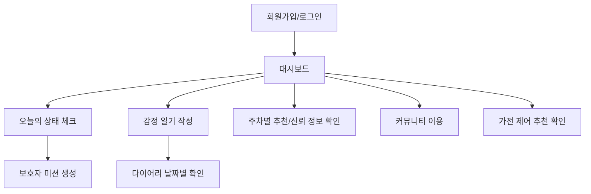
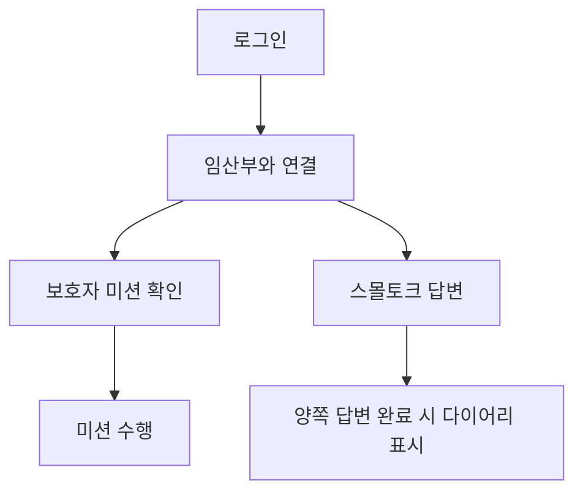
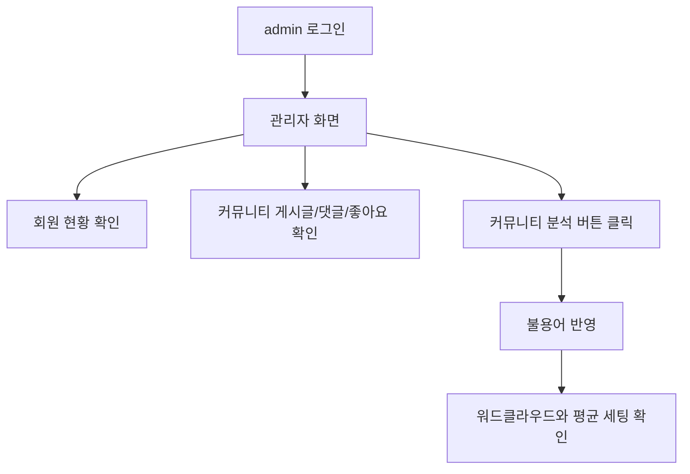

# MOMent(맘달) 화면설계서

## 1. 문서 목적

본 문서는 MOMent 프로젝트의 실제 화면 구성을 정리한 화면설계서다. `정의서 정리.xlsx`의 화면설계 기준인 화면 ID, 화면명, 관련 유스케이스, 화면 개요, 메뉴 경로, 주요 기능, 데이터 연동, 예외 사항을 기준으로 작성했다.

## 2. 전체 화면 구조

| 구분 | 화면 |
|---|---|
| 시작/인증 | 시작 화면, 로그인, 회원가입 |
| 사용자 홈 | 대시보드, 오늘의 팁, 오늘의 상태 체크, 스몰토크 |
| 케어 기능 | 감정 일기, 다이어리 달력, AI 맞춤 추천, 주차별 추천, 스트레칭 |
| 정보 기능 | 신뢰 정보, 정부 혜택 |
| 관계 기능 | 스몰토크, 보호자 미션, 공유 일정 |
| 커뮤니티 | 게시글 목록, 게시글 작성, 댓글, 좋아요 |
| 가전 제어 | 추천 가전 세팅, LG 가전 사이트 이동, Arduino 시연 |
| 마이페이지 | 내 정보, 설정 |
| 관리자 | 회원 관리, 커뮤니티 관리, 커뮤니티 분석 |

## 3. 화면 ID 목록

| 화면 ID | 화면명 | 메뉴 경로 | 관련 유스케이스 |
|---|---|---|---|
| `START_001` | 시작 화면 | 앱 진입 | UC-02 |
| `AUTH_LOGIN_001` | 로그인 | 시작 > 로그인 | UC-02 |
| `AUTH_REGISTER_001` | 회원가입 | 시작 > 회원가입 | UC-01 |
| `DASHBOARD_001` | 대시보드 | 하단 홈 | UC-03, UC-06, UC-07 |
| `STATUS_CHECK_001` | 오늘의 상태 체크 | 대시보드 > 상태 체크 | UC-03 |
| `MISSION_001` | 보호자 미션 | 대시보드 > 미션 | UC-04 |
| `DIARY_CALENDAR_001` | 다이어리 달력 | 하단 다이어리 | UC-05, UC-06 |
| `DIARY_FORM_001` | 감정 일기 작성 | 다이어리 > 작성 | UC-05 |
| `SMALLTALK_001` | 스몰토크 | 대시보드 > 스몰토크 | UC-06 |
| `AI_RECOMMEND_001` | AI 맞춤 추천 | 대시보드 > 추천 | UC-07 |
| `INFO_001` | 신뢰 정보 | 대시보드 > 신뢰 정보 | UC-08 |
| `BENEFITS_001` | 정부 혜택 | 신뢰 정보 > 혜택 | UC-08 |
| `COMMUNITY_001` | 커뮤니티 | 대시보드 > 커뮤니티 | UC-09 |
| `APPLIANCE_001` | 가전 제어 | 하단 가전제어 | UC-10 |
| `PROFILE_001` | 내 정보 | 하단 내 정보 | UC-01 |
| `SETTINGS_001` | 설정 | 하단 설정 | 공통 |
| `ADMIN_001` | 관리자 회원 | 관리자 > 회원 | UC-11 |
| `ADMIN_COMMUNITY_001` | 관리자 커뮤니티 | 관리자 > 커뮤니티 | UC-11 |
| `ADMIN_ANALYTICS_001` | 관리자 커뮤니티 분석 | 관리자 > 커뮤니티 분석 | UC-12 |

## 4. 주요 화면 상세

### 4.1 로그인 화면

| 항목 | 내용 |
|---|---|
| 파일 | `Project/src/app/LoginView.tsx` |
| 목적 | 이메일과 비밀번호로 사용자를 인증한다. |
| 입력 | 이메일, 비밀번호 |
| 버튼 | 로그인, 회원가입 이동 |
| API | `POST /api/auth/login` |
| 성공 | 임산부/보호자는 대시보드, 관리자는 관리자 화면으로 이동 |
| 예외 | 서버 통신 실패 시 "서버와 통신할 수 없습니다" 유형의 오류 표시 |

### 4.2 회원가입 화면

| 항목 | 내용 |
|---|---|
| 파일 | `Project/src/app/RegisterView.tsx` |
| 목적 | 임산부 또는 보호자 계정을 생성한다. |
| 입력 | 이메일, 비밀번호, 이름, 역할, 임신 시작일 |
| 화면 기준 | 임산부/보호자 역할을 이모티콘과 함께 표시한다. |
| 안내 문구 | 비밀번호 입력칸 아래, 날짜 입력 위에 "임신 시작 날짜를 적어주세요!"를 표시한다. |
| API | `POST /api/auth/register` |

### 4.3 대시보드 화면

| 항목 | 내용 |
|---|---|
| 파일 | `Project/src/app/DashboardView.tsx` |
| 목적 | 임산부의 현재 상태와 주요 기능 진입점을 제공한다. |
| 주요 영역 | 오늘의 팁, 정부 혜택 추천, 상태 체크, 스몰토크, 추천 기능 진입 |
| 데이터 | 사용자 임신 시작일을 기준으로 현재 주차 계산 |
| 특징 | 오늘의 팁은 주차별로 나뉘며 날짜에 따라 다른 팁이 표시된다. |

### 4.4 오늘의 상태 체크 화면

| 항목 | 내용 |
|---|---|
| 파일 | `Project/src/app/DiscomfortView.tsx` |
| 목적 | 임산부가 오늘의 증상과 감정을 입력한다. |
| API | 상태 체크 저장 및 보호자 미션 생성 API |
| 결과 | `PREGNANCY_STATUS_CHECKS`, `GUARDIAN_MISSIONS`에 반영 |
| 주의 | 일기 저장 기능이 아니라 보호자 미션 생성의 시작점이다. |

### 4.5 보호자 미션 화면

| 항목 | 내용 |
|---|---|
| 파일 | `Project/src/app/MissionView.tsx` |
| 목적 | 보호자가 임산부를 위해 수행할 미션을 확인한다. |
| 데이터 | `GUARDIAN_MISSIONS` |
| 표시 기준 | 임산부의 민감한 상세 상태를 그대로 노출하지 않고 행동 미션 중심으로 표시한다. |

### 4.6 다이어리 화면

| 항목 | 내용 |
|---|---|
| 파일 | `Project/src/app/DiaryView.tsx`, `Project/src/app/DiaryEntryForm.tsx` |
| 목적 | 감정 일기와 공유 일정을 날짜별로 관리한다. |
| 전체보기 | 공유 일정 중심으로 표시한다. |
| 날짜 클릭 | 해당 날짜의 감정 일기와 조건 충족 스몰토크를 표시한다. |
| 감정 표시 | 이모티콘과 텍스트 감정명을 함께 표시한다. |
| API | 일기 조회/작성, 공유 일정 조회 |

### 4.7 스몰토크 화면

| 항목 | 내용 |
|---|---|
| 파일 | `Project/src/app/SmalltalkView.tsx` |
| 목적 | 임산부와 보호자가 같은 질문에 답변한다. |
| 위치 | 홈/대시보드 기능으로 유지한다. |
| 다이어리 표시 조건 | 임산부와 보호자 모두 답변한 경우에만 날짜 상세에서 표시한다. |
| 데이터 | `SMALL_TALK_TOPICS`, `SMALL_TALK_ANSWERS` |

### 4.8 AI 맞춤 추천 화면

| 항목 | 내용 |
|---|---|
| 파일 | `Project/src/app/AIRecommendView.tsx`, `AIWeeklyRecommendView.tsx`, `AIStretchView.tsx` |
| 목적 | 임신 주차에 맞는 식품, 활동, 주의사항, 스트레칭을 제공한다. |
| 데이터 | `WEEKLY_AI_RECOMMENDATIONS`, 프론트 추천 데이터 |
| 기준 | 임신 시작일 기준 현재 주차 |

### 4.9 신뢰 정보와 정부 혜택 화면

| 항목 | 내용 |
|---|---|
| 파일 | `Project/src/app/InfoView.tsx`, `Project/src/app/PregnancyBenefitsView.tsx` |
| 목적 | 공신력 있는 임신 정보와 정부 혜택을 제공한다. |
| 탭 | 영양, 운동, 정신건강, 태아발달, 수면, 정부 혜택 |
| 정부 혜택 버튼 | "현재 받을 수 있는 혜택보기" |
| 표시 기준 | 임신/출산 상황, 주차, 사용자 상태 |

### 4.10 커뮤니티 화면

| 항목 | 내용 |
|---|---|
| 파일 | `Project/src/app/CommunityView.tsx`, `MyCommunityView.tsx` |
| 목적 | 임산부와 보호자가 게시글과 댓글로 정보를 공유한다. |
| 기능 | 게시글 작성, 댓글 작성, 좋아요 |
| 좋아요 기준 | 계정당 같은 게시글 1회 |
| API | `/api/community/posts`, `/api/community/posts/{post_id}/like` |

### 4.11 가전 제어 화면

| 항목 | 내용 |
|---|---|
| 파일 | `Project/src/app/ApplianceControlView.tsx` |
| 목적 | 감정과 환경에 맞는 가전 세팅을 추천한다. |
| 데이터 | `APPLIANCE_SETTINGS` |
| 시연 | Arduino를 이용한 LED, 팬, 센서 기반 단순 시각화 |
| 수익성 요소 | "LG 가전을 연동하여 더 많은 가전을 연동해보세요" 문구와 LG 가전 사이트 이동 버튼 |

### 4.12 관리자 화면

| 항목 | 내용 |
|---|---|
| 파일 | `Project/src/app/AdminView.tsx` |
| 목적 | 운영자가 서비스 데이터를 확인하고 관리한다. |
| 탭 | 회원, 커뮤니티, 커뮤니티 분석 |
| 회원 탭 | 전체 회원, 임산부/보호자 구분, 대리 접속, 삭제 |
| 커뮤니티 탭 | 게시글, 댓글, 좋아요 수, 삭제 |
| 분석 탭 | 워드클라우드, 불용어 입력, 감정 힌트, 평균 환경/가전 세팅 |
| API | `/api/admin/overview/{admin}`, `/api/admin/community/analyze/{admin}` |

## 5. 사용자 흐름

### 5.1 임산부 흐름

### 5.2 보호자 흐름

### 5.3 관리자 흐름

## 6. 화면 설계 체크리스트

| 항목 | 반영 여부 |
|---|---|
| 화면 ID와 화면명이 정의되어 있는가 | 반영 |
| 각 화면의 목적과 관련 유스케이스가 연결되어 있는가 | 반영 |
| API와 데이터 테이블이 연결되어 있는가 | 반영 |
| 모바일 화면 기준으로 설계되어 있는가 | 반영 |
| 스몰토크 홈 기능과 다이어리 표시 조건이 구분되어 있는가 | 반영 |
| 관리자 화면이 실제 백엔드 데이터와 연동되어 있는가 | 반영 |
| 커뮤니티 좋아요와 관리자 좋아요 수가 반영되어 있는가 | 반영 |
| 정부 혜택과 오늘의 팁 추천이 반영되어 있는가 | 반영 |

## 7. 변경 이력

| 날짜 | 내용 |
|---|---|
| 2026-06-02 | 실제 React 화면과 백엔드 API 기준으로 화면설계서 재작성 |
| 2026-06-02 | 관리자 화면, 커뮤니티 좋아요, 정부 혜택, 가전 제어 수익성 요소 반영 |
| 2026-06-02 | 스몰토크 홈 유지 및 다이어리 조건부 표시 흐름 반영 |
